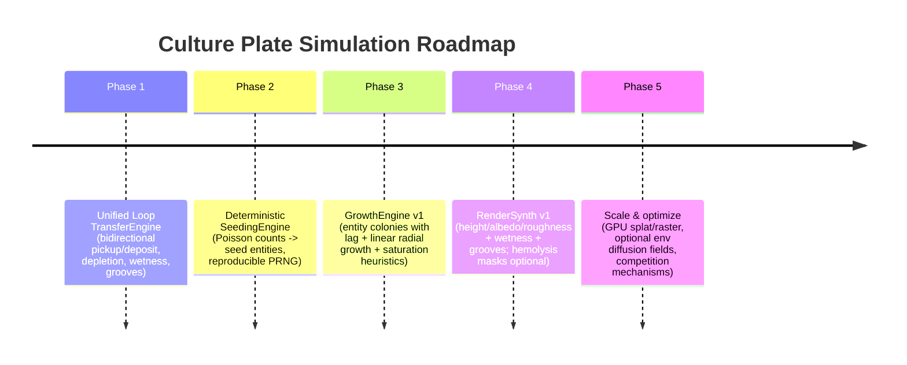

# Clean, extensible architecture for a microbiology culture‑plate simulation

## Executive summary

A culture‑plate simulation that “feels microbiologically grounded” can be architected cleanly by enforcing a strict separation between (a) **inoculum transfer on a wet agar surface** and (b) **colony growth from founders**—because the core purpose of streak plating is *mechanical separation/progressive dilution* to obtain isolated colonies derived from a single precursor cell, and because moisture/condensation can “ruin isolation” by letting microbes move across the moist surface and create confluent growth. 

The recommended system is a five‑layer state model with explicit stage boundaries:

- **Inoculum film layer (paint/smear physics):** a multi‑species, smudgeable thin‑film mass field plus wetness/groove fields (not “biomass”). Grounded by ASM’s emphasis on dry agar surface for isolation and on moisture causing confluent growth.   
- **Founders (seeds):** derived deterministically from the film via **Poisson‑style sampling with deterministic PRNG**; this matches standard CFU counting theory where colony counts are frequently modeled as Poisson under “random placement” assumptions, and explicitly accounts for the known “crowding/merging” regime where colonies merge and violate the “one microbe → one colony” assumption.   
- **Colony growth:** best modeled as a **hybrid**: colonies as entities (for lag/appearance and morphology) plus optional environment fields (nutrient/waste) for resource control. This aligns with empirical growth phenomenology where colonies often show a period after seeding followed by an extended regime of *linear radial expansion / constant edge growth zone* and later saturation as nutrients deplete or inhibitory byproducts accumulate.   
- **Render inputs:** produced from the biological state (height, albedo, roughness, wetness, grooves, hemolysis masks). ASM protocols provide concrete, canonical descriptors for colony appearance (smooth/rough/mucoid; opacity; pigment; texture) and hemolysis definitions (β clear zone; α green/brown discoloration), which can map cleanly onto shader controls without the renderer dictating biology.   
- **Final renderer:** consumes renderer‑friendly textures/data (heightfield + material maps).

A key architectural conclusion regarding your “Unified Loop Model” plan: **unifying paint/pickup/spread into one bidirectional loop operator is directionally correct** because streak plating fundamentally relies on repeated dilution and transfer between tool and surface.  The “GPU Growth Pipeline” portion should be treated as *optional backends* (CPU or GPU) behind a stable interface; the most robust first pass is usually CPU growth + GPU rasterization, because entity growth is easier to keep discrete and interpretable than reaction‑diffusion‑style fields (which can drift toward “pattern art” rather than colony‑from‑founder behavior). 

A short “what to choose now” table:

| Problem slice | Recommended choice | Why it’s correct‑in‑shape |
|---|---|---|
| Painted inoculum layer | **Multi‑species film mass grid** + wetness + grooves | Captures dryness/moisture effects on isolation, supports pickup/deposit/smear without conflating with mature biomass.  |
| Lots of seeds | **Hybrid**: per‑cell Poisson counts → sparse seed entities (deterministic PRNG) | Matches Poisson CFU model (uncrowded regime) while acknowledging crowding/merging regimes and ensures reproducibility.  |
| Growth after seeding | **Hybrid**: colony entities + optional nutrient/waste fields | Supports lag/appearance time and phase transitions (linear edge growth → saturation).  |
| Confluence | Emerges from **overlap/crowding + growth limits** | Crowding merges colonies (bias in CFU counting); density affects growth/size.  |
| Mixed species | Stage: visual blending now; competition later (contact/diffusible) | Competition for space/resources is real; contact‑dependent inhibition can create sharp boundaries and change spatial arrangement.  |

Risk mitigation checklist (short): (i) keep film/seeds/colonies separate, (ii) enforce determinism at PRNG boundary, (iii) validate streak dilution and condensation→confluence behaviors with automated tests, (iv) cap growth complexity until the transfer model is correct. 

## Proposed architecture

### Design goals distilled from primary sources and your constraints

1) **Streaking is progressive dilution and mechanical separation**.   
2) **Dryness matters**: a dry agar surface supports isolation, while condensation/moisture can ruin isolation by allowing movement across a moist surface and creating confluent growth.   
3) **Isolated colonies are treated as clonal founders from single precursor cells/CFUs**, acknowledging that “CFU” is an operational unit and that high density causes colony merging and biases.   
4) **Colony growth has phases**: early growth can be exponential (often below visual resolution), then an extended regime where radial growth becomes linear with a constant growth zone at the edge, followed by saturation when nutrients are scarce or inhibitory byproducts accumulate.   
5) **Phenotype/visual morphology is real and media‑dependent**; protocols describe standard descriptors that can drive rendering parameters (smooth/rough/mucoid, opacity, pigment, margin/elevation).   
6) **Blood agar hemolysis is diagnostically defined and visually specific** (β = clear zone; α = green/brown discoloration; read with transmitted light).   

### Recommended modular decomposition

Treat each stage as a module with a clean interface and stable data contracts:

- **TransferEngine**: loop ↔ inoculum film (bidirectional pickup/deposit + smear + depletion).  
- **SeedingEngine**: film → founders (deterministic Poisson/PRNG).  
- **GrowthEngine**: founders → colonies (entity/hybrid; optional environment fields).  
- **RenderSynth**: colonies/environment → render textures (height/albedo/roughness/hemolysis/wetness/grooves).  
- **Renderer**: photoreal plate shading; consumes textures only.

This accommodates your “Unified Loop Model” rewrite directly as the TransferEngine core (single `advanceLoop()` path), while de‑risking the “GPU growth pipeline” by making GrowthEngine pluggable without forcing reaction‑diffusion. 

### Dataflow blueprint

```mermaid
flowchart LR
  UI[Pointer/pen input] --> TE[TransferEngine: loop <-> film]
  TE --> FILM[Inoculum Film Layer: filmMass[s], wetness, grooves]
  FILM --> SEED[SeedingEngine: deterministic sampling]
  SEED --> FOUND[Founder/Seed Layer: seed entities or counts]
  FOUND --> GE[GrowthEngine: colonies + env]
  GE --> STATE[Colony/Env State]
  STATE --> RS[RenderSynth: height/albedo/roughness/hemolysis]
  RS --> RENDER[Plate Renderer (PBR/heightfield shading)]
```

The key correctness property is that **FILM → FOUND is a one‑way semantic boundary**: the drawn film is not “mature biomass.” This matches microbiology practice: streaking places isolated precursors that then multiply into visible colonies; moisture influences whether isolation succeeds or collapses into confluence. 

### GPU pipeline ideas you can borrow without committing biology to GPU

The referenced WebGL fluid sim demonstrates three patterns that are directly reusable for “smear physics” and fast raster operations:

- **Splat‑additive injection**: adds a Gaussian‑like contribution `exp(-dot(p,p)/radius)` to the existing texture, i.e., `base + splat`.   
- **Advection with dissipation**: backtraces along a velocity field and applies decay/dissipation (`result / decay`).   
- **Ping‑pong (double FBO) state**: uses paired framebuffers for dye/velocity so each pass reads from one and writes to the other.   

Even if you keep growth on CPU, these GPU patterns are valuable for: (i) smearing the film (if you decide to add velocity), (ii) rasterizing many colonies quickly, and (iii) generating render maps at 512²–1024² without CPU bottlenecks. 

## Recommended data model

### Core state objects

Below is a practical, serializable data model that supports multi‑species end‑to‑end and keeps rendering independent of biology.

**PlateState**
- `resolution: {w,h}`
- `rngSeed: uint64` (plate‑level deterministic seed)
- `film: FilmLayer`
- `founders: FounderLayer`
- `colonies: ColonyState`
- `env: EnvState` (optional)
- `render: RenderInputs` (generated, not authoritative)

**FilmLayer** (paint/smear substrate; *not* mature biomass)
- `filmMass[s][i,j]: float32` — viable inoculum “mass” per species *s*
- `wetness[i,j]: float32` — moisture; drives smear + (later) affects isolation/confluence
- `groove[i,j]: float32` — mechanical disruption from loop pressure/angle (render + possibly transfer)
- (optional) `filmCarrier[i,j]: float32` — if you want “fluid volume” separate from “cells”

**LoopState** (your unified loop reservoir)
- `loopLoad[s]: float32` — carried inoculum per species
- `sterile: bool` (or just `loopLoad=0`)
- `temperatureHot: float32` or simple `isHot` if you want cooldown/sterilize UX hooks
- `params: {pickup, deposit, depletion, kernel}`

**FounderLayer**
- Recommended hybrid encoding:
  - `seedCount[s][i,j]: uint16` (intermediate count grid)
  - `seeds: Array<Seed>` sparse seed entities generated deterministically from counts

**ColonyState**
- `colonies: Array<ColonyEntity>`
- Optional spatial index: `gridBins` for neighbor queries / raster acceleration
- Optional “lawn patches”: `patchCoverage[s][i,j]` if you later hybridize entities→field

**RenderInputs**
- `height[i,j]: float16/float32`
- `albedo[i,j]: rgba8` or `float16 rgb`
- `roughness[i,j]: float16`
- `specular[i,j]: float16` (or derived)
- `subsurfaceMask[i,j]: float16`
- `hemolysisAlpha[i,j]: float16`
- `hemolysisBeta[i,j]: float16`
- `wetMask[i,j]: float16`
- `grooveMask[i,j]: float16`

This mapping is justified because protocols explicitly define colony morphology descriptors (smooth/rough/mucoid, opacity, pigment, etc.) and hemolysis categories with visual definitions suitable for masks/parameters.   

### Question one: best representation for the painted inoculum layer

A streak plate is a transfer process; the surface condition (dry vs moist) is critical and moisture can cause confluent growth by allowing bacteria to move across the surface.  Therefore, your inoculum representation must support: pickup, deposit, smudge, and wetness.

**Comparison table: inoculum layer representations**

| Option | Representation | Strengths | Weaknesses | When to use |
|---|---|---|---|---|
| Density grid (static) | `filmMass[s][i,j]` only | Simple; deterministic; easy blending | Hard to get “smear” feel without extra rules | Good baseline, but can feel “paint‑like” |
| Velocity‑free smear | `filmMass` + `wetness` + directional “push” | Captures smear + dry/wet behavior without full fluid | Needs tuned heuristics; can artifact | **Recommended POC** |
| Full 2D fluid | `filmMass` as dye + `velocity` field + advection | Natural smearing; fast on GPU (ping‑pong) | More complexity; stability/artifacts; harder determinism | If you want “liquid realism” and are OK with approximations |
| Particle film | particles carrying species + fluid props | Natural streak textures; sparse | Hard to conserve mass and stay stable; expensive | When visuals dominate and counts can be approximate |
| Hybrid film | grid + sparse “clumps” | Best of both; can model aggregates | Complexity and tuning | Advanced phase |

**Recommendation:** **Velocity‑free smear map**: multi‑channel `filmMass[s]` plus `wetness` and an optional `groove` field. It is the simplest representation that can still model the protocol‑critical dryness/moisture effects and allows bidirectional loop transfer without conflating film with final biomass.   

**Algorithm sketch (transfer‑centric, deterministic, CPU‑friendly)**

- A loop stroke is discretized into stamps along the pointer path.
- At each stamp: sample film under kernel; pickup fraction and deposit fraction depend on wetness and pointer speed/pressure; then apply depletion.

Pseudocode (conceptual):

```pseudo
function advanceLoop(pathPoints, loopState, film, params):
  for each stamp in resample(pathPoints, step = params.stampSpacing):
    K = kernel(stamp.pos, params.radius, params.kernelShape)

    # 1) PICKUP (film -> loop) before deposit
    picked[s] = params.pickupRate * wetnessFactor(film.wetness, stamp.pos) * sum(film.filmMass[s] * K)
    film.filmMass[s] -= picked[s] * K_normalized
    loopState.loopLoad[s] += picked[s]

    # 2) DEPOSIT (loop -> film)
    depositAmt[s] = params.depositRate(stamp) * loopState.loopLoad[s]
    film.filmMass[s] += depositAmt[s] * K_normalized
    loopState.loopLoad[s] -= depositAmt[s]

    # 3) SMEAR (optional): directional push of film mass
    film = smearDirectional(film, stamp.velocity, params.smearStrength)

    # 4) DEPLETE (reservoir thinning)
    loopState.loopLoad[s] *= params.depletionPerStamp(stamp)
```

**Complexity/performance:** For `Nstamps` stamps, kernel area `A` cells, and `S` species, complexity is `O(Nstamps * A * S)`. With `S≤4` and modest brush radii, this is typically fine at 256²–512² on CPU if you limit updates to a bounding box per stamp and use typed arrays.

**Why this aligns with microbiology:** Streaking aims for dilution across regions; crossing prior streaks should re‑introduce cells to the tool and re‑deposit them later, which this pickup‑before‑deposit ordering naturally supports. The importance of dry agar and moisture‑driven confluence is explicitly stated by ASM, so modeling `wetness` as a first‑class field is not just aesthetics.   

### Question two: best representation for “lots of seeds”

Primary literature on CFU counting supports that, in an ideal uncrowded regime, colony counts are often modeled as **Poisson distributed** under assumptions like well‑mixed sample and random placement on agar; it also emphasizes that at high densities colonies merge, violating “one cell → one colony.”  This is almost exactly your problem: you want a deterministic “founder map,” but you also want the right statistical shape of isolated vs confluent outcomes.

**Comparison table: seed representations**

| Option | Representation | Strengths | Weaknesses | Recommended use |
|---|---|---|---|---|
| Dense counts | `seedCount[s][i,j]` only | Compact; fast; deterministic | Hard to render discrete colonies without extra work | Intermediate layer |
| Sparse particles | list of `Seed{x,y,species}` | Natural colonies; cheap growth | Memory spikes at high densities | If densities moderate |
| Poisson‑disk/blue noise | seeds with minimum distance | Visually pleasing distributions | Less statistically grounded; suppresses clustering | Art/UX override |
| Hybrid (best) | counts grid → seeded particles + optional cap | Deterministic; scalable; supports both sparse and dense | Slightly more code | **Recommended** |

**Recommendation:** Use a **hybrid count→entity pipeline**:
1) compute `λ[s,i,j]` from `filmMass[s,i,j]` (tunable scale);
2) sample `k ~ Poisson(λ)` deterministically per cell;
3) expand `k` into `k` seed entities with deterministic sub‑cell jitter.

This directly mirrors the Poisson CFU model in the uncrowded regime while leaving you room to clamp densities or switch to a “crowding model” when `λ` is large (consistent with crowding/merging theory).   

**Deterministic PRNG strategy (reproducibility first)**  
Do not use `Math.random()`. Use a stable PRNG whose output is independent of platform and frame timing.

- Define a plate‑level `uint64 plateSeed`.
- For each cell and species, derive a stream seed:
  - `seed = hash64(plateSeed, speciesId, i, j, "seed")`.
- Use a PRNG like SplitMix64/Xoroshiro (or a well‑tested 32‑bit equivalent if JS constraints) to produce uniform floats in `(0,1)` deterministically.

**Deterministic Poisson sampling**  
For small/medium λ, the Knuth product method is simple and deterministic; for large λ, switch to an approximation (normal or transformed rejection) but keep the PRNG stream identical.

Pseudocode:

```pseudo
function poissonDeterministic(lambda, rng):
  if lambda <= L_SWITCH:
    # Knuth
    L = exp(-lambda)
    k = 0
    p = 1
    do:
      k += 1
      p *= rng.uniform01()
    while p > L
    return k - 1
  else:
    # Large-lambda branch (deterministic): normal approx or PTRS
    return poissonLarge(lambda, rng)
```

**Complexity:**  
Seeding cost is `O(W*H*S)` for the λ grid plus Poisson draws, but can be restricted to dirty rectangles (regions affected by new film) or deferred until “incubate” begins.

## Simulation stages in order

A staged pipeline matches both microbiology practice (streak → incubate → observe colonies/hemolysis/morphology) and engineering needs (testability and separable concerns). 

### Stage sequence

1) **Interactive streaking (TransferEngine)**  
   - Input: pointer path + loop state (loaded/sterile)  
   - Output: updated filmMass/wetness/grooves  
   - Grounding: streaking is mechanical separation; plate should be dry; condensation causes movement and confluent growth.   

2) **Film relaxation / drying (optional, but recommended)**  
   - Short time constant decay of `wetness` toward baseline; optionally smear strength decreases as wetness drops.  
   - Grounding: ASM notes dry surface is necessary for isolation; moisture changes outcomes.   

3) **Founder deposition (SeedingEngine)**  
   - Film → seedCount → seed entities, deterministic PRNG  
   - Grounding: CFU/Poisson models and the definition of “isolated colonies from single precursors” as goal.   

4) **Growth simulation (GrowthEngine)**  
   - Seeds → colonies (with lag/appearance and radial growth)  
   - Grounding: colony radial growth often enters a linear regime with constant edge growth zone and later saturation due to nutrient depletion or inhibitory byproducts; colony growth depends on strain and conditions.   

5) **Render synthesis (RenderSynth)**  
   - Colonies/environment → height/albedo/material/hemolysis  
   - Grounding: colony morphology descriptors are standardized; hemolysis classes and appearance are defined by ASM protocols.   

6) **Photoreal rendering (Renderer)**  
   - Heightfield shading + wetness/specular + agar base + masks; renderer consumes maps only.

### Question three: how should colony growth work after seeding?

Empirical and modeling studies support a simplified but grounded phenomenology:

- Colonies can show **constant radial expansion** over long intervals on hard agar, while vertical growth slows and can saturate, with gradients and mechanical constraints playing roles.   
- Colony radial growth curves are often described by phases: initial exponential radius increase (often below imaging resolution), then a **linear radial regime** where the growth zone at the edge becomes constant, then saturation as nutrients become scarce or inhibitors accumulate.   

That evidence strongly favors a growth model that naturally represents:
- per‑colony lag/appearance time,
- edge‑driven radial expansion,
- saturation/competition in dense conditions.

**Comparison table: growth models**

| Model | State | Pros | Cons | Best fit |
|---|---|---|---|---|
| Entity colonies | list of colonies (pos, r, h, age) | Discrete colonies; easy lag/morphology; easy debugging | Rasterization cost; merging logic | **Strong POC** |
| Field biomass (PDE) | `biomass[s][i,j]` | GPU‑friendly; smooth | Can blur colonies; harder “founder realism” | For lawns/continuous biofilms |
| Voronoi territory | seeds + region assignment | Confluence emerges; simple boundaries | Looks “cellular/diagrammatic” | Stylized / fast |
| Eden / cellular automata | lattice growth | Captures range expansion / sectors | Parameter tuning; artifacts | If you want genetic drift/sectoring style |
| Hybrid (recommended) | entities + local fields | Discrete + resource effects + scalable | More plumbing | **Best long‑term** |

**Recommendation:** start with **entity colonies** and add an optional environment field later (hybrid). Tie growth laws to tunable parameters, not fixed constants.

**Entity ColonyEntity (minimal fields)**
- `id: uint32`
- `speciesId: uint8`
- `pos: float2`
- `birthTime: float`
- `lagTime: float` (species‑specific distribution)
- `radius: float`
- `height: float`
- `state: {latent, microcolony, visible, saturated}`

**Growth law sketch (open‑ended parameters)**
- If `t < birthTime + lagTime`: no visible growth (or micro growth below threshold).  
- After lag:  
  - `dr/dt = g_edge(species, envLocal, crowding)`  
  - `dh/dt = g_vertical(species, envLocal, crowding)`  
- Saturation: reduce `dr/dt` and `dh/dt` as crowding increases or env decreases.

A scientifically grounded simplification is to default to a **linear radial regime** after appearance (since this is often the regime observable at whole‑plate imaging resolutions), while allowing slower/halted growth as nutrients deplete or inhibitors accumulate. 

**Crowding/competition hook (even before true mixed‑species biology)**  
Scientific Reports notes that colony density affects growth because neighboring colonies compete locally for nutrients and enter saturation earlier on dense plates.   
So even in a POC, you can modulate growth by local occupancy, e.g. `crowding = coverageSum(neighborhood)`.

### Question four: how should confluent growth emerge and merge?

Two independent lines of evidence justify “confluence emerges from crowding”:

- CFU methodology explicitly recognizes that at high colony densities, colonies **merge** and the “each microbe corresponds to one colony” assumption breaks; counts become biased downward.   
- Colony growth analysis tools explicitly model density‑driven entry into saturation and reduced colony sizes on dense plates.   

**Recommendation:** model confluence as a *derived phenomenon* from:
1) high local founder density (many seeds close together), and/or  
2) high surface coverage from expanding colonies, and/or  
3) wetness effects that increase effective smearing/mobility and reduce isolation success, consistent with ASM’s statement about moisture enabling spread and confluent growth.   

Implementation approach:
- Do **not** “switch to lawn mode.”  
- Instead, compute a per‑species `coverage[s][i,j]` via rasterization of colony kernels (disks or smooth domes).  
- Define “confluent lawn” as cells where `coverageTotal` exceeds a threshold for a sustained period, and optionally where colonies are dense enough that individual peaks are visually suppressed (render stage smoothing).

This way, in sparse areas you get isolated colonies; in dense areas you get merged coverage automatically.

### Question five: how to handle mixed species?

Microbes compete for space and resources; there are diverse mechanisms, including diffusible toxins and contact‑dependent systems.  A spatially structured colony can show sharp boundaries and altered spatial arrangement due to contact‑dependent growth inhibition, and competition outcomes depend on factors like initial density and inhibition parameters rather than only intrinsic growth rates.   

**Recommendation (staged complexity):**

**Stage A (POC): visual + geometric mixing**
- Film/loop: full multi‑species mixing via vector pickup/deposit (this is where your current system likely fails).
- Growth: each species grows independently; overlap resolution is purely visual:
  - `color = weightedBlend(biomass[s])` (if you want “mixed” appearance), or
  - `winnerTakeMost` (max biomass) if you want sharper boundaries.
- This already yields multi‑species streaking and “smearing through previous streaks” behavior.

**Stage B (competition lite): density‑limited growth**
- Add local carrying capacity or nutrient field shared among species:
  - total biomass consumes nutrient; nutrient limits all species.
- This captures “faster growers dominate” without modeling toxins. The idea that growth rate is a saturating function of resources is consistent with Monod‑style phenomenology, while modern work emphasizes multi‑nutrient/global constraints and discourages over‑commitment to a single exact functional form—supporting your desire to keep constants tunable.   

**Stage C (mechanism‑based antagonism): contact + diffusion**
- Contact-dependent inhibition: sharp boundaries, sector suppression, density dependence.   
- Diffusible inhibition/antibiotics: implement an inhibitor field diffusion producing zones of inhibition (a well‑established concept in agar diffusion assays).   

### Question six: cleanest way to generate renderer inputs

Anchor render inputs in standardized microbiology descriptors rather than ad‑hoc shader features:

- Colony morphology protocol: smooth vs rough vs mucoid; opacity; pigmentation; form/elevation/margin; texture descriptors like butyrous/viscous/dry.   
- Blood agar hemolysis protocol: β clear zone (complete lysis); α green/brown discoloration (methemoglobin; not true lysis); read with transmitted light.   

**RenderSynth mapping (suggested)**  
- `height`: from colony entities (dome profile) + optional grooves.  
- `albedo`: base agar color + species pigment + opacity effects.  
- `roughness/specular`: derived from morphology:
  - smooth → lower roughness / sharper highlights  
  - mucoid → high specular “wet” look  
  - dry/rough → higher roughness, more diffuse  
  (Parameter mapping is a tunable art direction layer; morphology categories are protocol‑defined.   
- `hemolysisAlpha/Beta`: radial halos around colonies for select species/media; β is a “clear zone,” α is “green/brown discoloration,” so they should not be the same mask.   
- `wetMask`: from `film.wetness` and from colony mucoidness (optional).  
- `grooveMask`: from painting pressure/angle; ASM explicitly notes students practice the “amount of force required to glide the loop over the surface of the agar without gouging,” which you can reinterpret as a groove field and a pressure hook.   

image_group{"layout":"carousel","aspect_ratio":"16:9","query":["quadrant streak plate isolated colonies photo","blood agar beta hemolysis clear zone transmitted light photo","blood agar alpha hemolysis green discoloration photo","mucoid bacterial colony agar plate photo"],"num_per_query":1}

### GPU vs CPU tradeoffs table

This table is intentionally stage‑specific: you can choose different backends per stage.

| Stage | CPU advantages | GPU advantages | Main risks | Practical recommendation |
|---|---|---|---|---|
| Transfer (loop↔film) | Deterministic; easy debugging; low latency | Very fast smearing/raster | GPU determinism + readback complexity | **CPU transfer** first; optional GPU smear later |
| Seeding (Poisson) | Deterministic PRNG; region updates | Possible via compute-ish shaders but awkward | PRNG on GPU varies; hard to reproduce | **CPU** |
| Growth (entities) | Natural discrete colonies; easy competition rules | Harder (needs raster/compute) | GPU growth tends toward fields | **CPU growth, GPU raster** |
| Env diffusion fields | Simple at low res | Very fast at large res | Precision/format pitfalls | Optional; start CPU then move GPU if needed |
| RenderSynth (maps) | Simple but can be slow | Very fast map synthesis | Tooling/debug | CPU for POC; GPU for scaling |
| Final rendering | N/A | Natural fit | Shader complexity | GPU renderer as you already plan |

The fluid sim repo provides a concrete example of ping‑pong FBO state and “splat” and “advection+decay” passes that can be reused if/when you move smear or raster steps to GPU.   

## What to simplify now

### Question seven: minimum POC architecture that is extensible

The minimum “correct in shape” architecture is:

1) **Unified bidirectional loop transfer** on a multi‑species film grid  
2) **Deterministic seeding** (Poisson counts → seed entities)  
3) **Entity‑based colony growth** with lag and post‑lag linear radial growth + saturation heuristics  
4) **RenderSynth** producing height/albedo/roughness + a simple wetness/spec map  
5) Keep the **PBR renderer inputs stable** so you can iterate biology without changing shading contracts.

This directly addresses the failure mode you identified (“can’t represent multi‑species streaks and smearing through previous streaks correctly”) because it forces you to fix mixing at the correct layer: transfer physics in the film, not colony growth.   

### Tunable parameters (leave numeric constants unspecified)

Treat these as per‑species/per‑media profiles; do not hard‑code “final values” up front.

**TransferEngine**
- `stampSpacing` (distance between stamps)
- `brushRadius`
- `kernelShape` (Gaussian vs ring/donut; ring supports your “less density at center” requirement)
- `pickupRate ∈ (0,1)`
- `depositRate ∈ (0,1)`
- `depletionPerStamp ∈ (0,1)` (reservoir thinning)
- `wetnessFactor(w)` (how moisture changes pickup/deposit)
- `smearStrength(w, speed)` (higher when wetter / slower)

**SeedingEngine**
- `seedScale` mapping filmMass → λ
- `lambdaClamp` (cap to avoid absurd k in one cell)
- `L_SWITCH` between small/large Poisson algorithms
- `seedJitter` (subcell)
- `determinismSalt` (string/constant to version sampling)

**GrowthEngine**
- `lagDistribution(species)` (mean/spread as tunable)
- `appearanceThreshold` (micro→visible transition; can mirror image‑analysis notion of minimum detectable radius)   
- `radialGrowthRate(species, env)` (defaults to linear regime; slowed by crowding)
- `verticalGrowthRate(species, env)` (with saturation)
- `crowdingInhibition` (function of local coverage)
- `resourceModel` (none in POC; later optional)

**RenderSynth**
- `speciesColor`, `pigmentStrength`, `opacity`
- `morphologyRoughness` mapping (smooth/rough/mucoid/dry)   
- `wetSpecularBoost` from wetness/mucoid
- `hemolysisAlphaRadius`, `hemolysisBetaRadius` (per species) aligned with α/β visual definitions   
- `grooveDepth` / `grooveRoughnessMod`

### Performance notes for the POC

- **Transfer updates should be sparse‑rect based**: update only the kernel bounding box per stamp, not the whole grid.  
- **Seeding can be deferred until “incubate”** to avoid repeating Poisson calls while painting; or you can keep an incremental “dirty rectangle” and reseed only changed areas, but ensure determinism by defining exactly when/where reseeding is allowed.
- **Growth should avoid O(N²) neighbor checks**: use grid bins by tile to query local neighbors.
- **Rasterization**: if colony count becomes large, move rasterization (not biology) to GPU via “splat” passes similar to the fluid sim’s additive splat shader.   

## What to defer

Deferring these is justified because (a) biology has many mechanisms and (b) even Monod‑style kinetics are a simplified phenomenology whose mechanistic basis can be debated; modern work argues for multi‑constraint/multi‑nutrient views, supporting your preference to keep constants open‑ended and fit the “shape” first.   

1) **Full nutrient/waste PDEs**  
   Start with “crowding inhibition” and a global resource dial. If/when you add fields, anchor them to the observation that growth saturates when nutrients are scarce or inhibitory byproducts accumulate.   

2) **Mechanism‑based mixed‑species warfare**  
   Competition exists and can reshape spatial arrangement (contact‑dependent inhibition, toxins, etc.), but implementing those mechanisms early can obscure whether streak transfer and seeding are correct.   

3) **Diffusible inhibition zones (antibiotics/bacteriocins)**  
   Diffusion‑based inhibition on agar is well established (zones of inhibition), so it’s a great later phase once your core pipeline works.   

4) **Full 2D Navier–Stokes smear**  
   The WebGL fluid sim’s advection and ping‑pong pipeline is inspirational, but you can get believable streaking with a velocity‑free smear and wetness rules first; later, you can selectively adopt splat/advection patterns on GPU.   

5) **Fine morphological detail synthesis**  
   Start with morphology‑driven roughness/specular and a height dome; defer wrinkles, fractal edges, and colony‑specific microstructures until growth outcomes are correct.

## Risks and failure modes

### Core failure modes (and why they matter)

1) **Conflating film with mature biomass**  
   Symptom: painted strokes immediately look like “grown colonies.”  
   Fix: enforce the film→founders boundary; colonies only come from seeds. Grounded by streak plating purpose: isolate colonies from diluted precursors.   

2) **Non‑mixing strokes (max‑blend / overwrite)**  
   Symptom: cross‑streaking does not change composition; dilution never emerges.  
   Fix: bidirectional pickup‑before‑deposit at each stamp; additive deposit and subtractive pickup.

3) **Determinism drift**  
   Symptom: seeds/colonies differ run‑to‑run.  
   Fix: all stochasticity must come from deterministic PRNG keyed by plateSeed + coordinates + species + version salt.

4) **Overcrowding artifacts**  
   Symptom: too many colonies at high density; perf collapse; visually noisy.  
   Fix: cap λ per cell, or switch to a crowding model at high density; crowding/merging is a known regime in CFU theory.   

5) **Mis-modeled wetness**  
   Symptom: everything becomes lawn, or nothing ever smears.  
   Fix: use ASM’s explicit statement that moisture enables movement and confluent growth as your guiding qualitative constraint; tune `wetness` to get both success and failure cases.   

6) **Mixed species becomes “paint mixing” only**  
   Symptom: colors blend but biology never competes.  
   Fix: stage competition; at minimum, implement shared crowding/resource effects; later add contact/diffusion mechanisms supported by competition literature.   

### Risk mitigation checklist (short)

- Keep **film**, **founders**, and **colonies** as separate authoritative states.   
- Enforce **deterministic PRNG** boundaries and version salts.  
- Add automated tests for: dilution gradient, condensation→confluence, and density→crowding/merge behavior.   
- Defer mechanism‑heavy competition until streaking + seeding are correct.   

## Suggested implementation plan

### Phased roadmap



### File/module mapping aligned to your existing names

Using your plan’s filenames as anchors (and keeping “renderer unchanged” as a contract), a clean refactor looks like:

- **REWRITE** `codex-streaking/codex-streak-sim.ts`  
  - Implement `advanceLoop()` unified operator; remove mode split; keep `LoopState` vector load.  
  - Add `wetness` and `groove` writes (pressure/speed hooks).  
- **MODIFY** `codex-streaking/codex-streak-types.ts`  
  - Define `FilmLayer`, `FounderLayer`, `ColonyState`, `LoopState`, `RenderInputs`.  
- **NEW** `codex-streaking/codex-streak-seeding.ts`  
  - Deterministic Poisson sampling + PRNG hashing utilities.  
- **NEW** `codex-streaking/codex-streak-growth-cpu.ts`  
  - Entity growth model; neighbor binning; crowding heuristics.  
- **NEW or REWRITE** `codex-streaking/codex-streak-render-synth.ts`  
  - Rasterize colonies to height/albedo/roughness; optional hemolysis.  
  - Map morphology categories (smooth/rough/mucoid/dry) to roughness/spec.   
- **MODIFY** `codex-streaking/codex-streak-lab.svelte`  
  - UI simplification: “Load sample”, “Sterilize”, and drag; show loop mass/composition.  
- **OPTIONAL NEW** `codex-streaking/colony-growth-gpu.ts`  
  - Keep as backend option primarily for raster/diffusion passes; avoid forcing RD biology.  
- **UNCHANGED (contract)** `reference/webgl-colony-renderer.ts`  
  - Treat as consumer of `RenderInputs` (height/albedo/material).  

This preserves your stated goal: rendering architecture should not dictate biology, while still allowing GPU acceleration where it’s naturally beneficial.

### Verification tests (engineering + microbiology‑shape)

Ground the tests in protocol‑described outcomes: dilution for isolation, moisture ruining isolation, colony discretization/merging under crowding, and standard morphology/hemolysis categories.   

**Transfer/streaking tests**
- **Dilution gradient test**: load loop, do a long streak; assert film mass decays along path (monotone trend within tolerance). This matches the “progressive dilution” intent of streak plating.   
- **Cross‑streak remix test**: streak species A, then pass through it with species B loaded; assert loop composition changes after the crossing and deposit becomes mixed.  
- **Condensation failure mode**: set wetness high; same streak pattern should yield more continuous coverage / less isolation, consistent with ASM’s warning about condensation causing movement and confluent growth.   

**Seeding tests**
- **Determinism**: same plateSeed + same film → identical seedCount and seed positions.  
- **Poisson regime sanity**: for low λ, variance≈mean across many cells (a property of Poisson) in aggregated stats (not as a hard law, but as a regression check).   
- **Crowding clamp**: high λ triggers cap/alternative logic to prevent unbounded seeds; this is consistent with “crowding/merging” being a distinct regime.   

**Growth tests**
- **Lag/appearance**: colonies become visible after lag/threshold; this aligns with colony “appearance time” concepts used in colony growth quantification.   
- **Linear radial regime**: after appearance, radius grows ~linearly over a configured window; saturation later reduces growth.   
- **Density effect**: high founder density yields smaller colonies / earlier saturation at fixed time, consistent with density‑driven competition effects.   

**RenderSynth tests**
- **Morphology mapping**: smooth vs rough vs mucoid alters roughness/spec in expected direction, grounded in ASM morphology categories.   
- **Hemolysis masks**: α produces discoloration mask; β produces clear‑zone mask; keep them distinct per ASM definitions.   

### UX affordances that reinforce correctness

- **Loop mass + composition UI**: a small bar for total “load” and stacked segments per species; makes dilution tangible.  
- **Sterilize**: instant `loopLoad=0`; consistent with real streak protocol where flaming removes organisms between streak sectors (and ASM/JoVE both emphasize sterile loops/plates and technique).   
- **Pressure/speed hooks**: record pointer velocity and (if available) pressure to modulate deposit/pickup and grooves; ASM explicitly notes practicing force to avoid gouging, giving you a biologically plausible reason to include a groove/force dimension.   
- **Wetness indicator**: a subtle overlay or specular cue; because dryness/condensation changes isolation outcomes.   

### Prioritized sources

High‑value primary/official references (cited throughout):
- entity["organization","American Society for Microbiology","professional society, us"] protocols: streak plate, colony morphology, blood agar hemolysis.   
- entity["organization","JoVE","video journal publisher"] protocols/videos on streak plating and aseptic plating (progressive dilution, colony formation, condensation minimization).   
- Peer‑reviewed/open articles on CFU Poisson modeling and crowding/merging.   
- Peer‑reviewed/open articles on colony expansion regimes and phase structure (linear radial regime; saturation; density effects).   
- Competition/interaction literature supporting staged mixed‑species modeling (contact‑dependent inhibition; competition for space/resources).   
- WebGL fluid sim implementation patterns (splat/additive, advection+dissipation, ping‑pong FBO). Created by entity["people","Pavel Dobryakov","webgl developer"] and hosted on entity["company","GitHub","code hosting platform"]. 